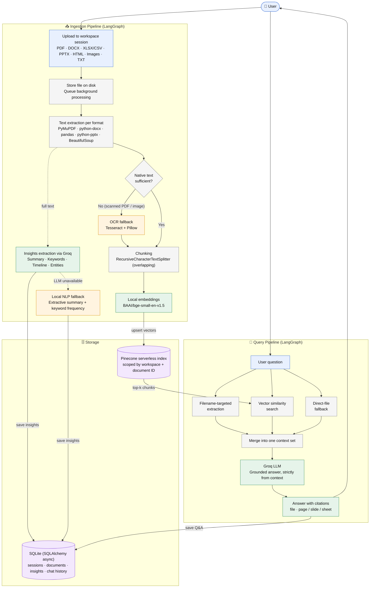

## Architecture

```mermaid
flowchart TB
    U(["👤 User"])

    subgraph ING["📥 Ingestion Pipeline (LangGraph)"]
        direction TB
        A["Upload to workspace session<br/>PDF · DOCX · XLSX/CSV · PPTX · HTML · Images · TXT"]
        B["Store file on disk<br/>Queue background processing"]
        C["Text extraction per format<br/>PyMuPDF · python-docx · pandas · python-pptx · BeautifulSoup"]
        D{"Native text<br/>sufficient?"}
        E["OCR fallback<br/>Tesseract + Pillow"]
        F["Chunking<br/>RecursiveCharacterTextSplitter (overlapping)"]
        G["Local embeddings<br/>BAAI/bge-small-en-v1.5"]
        H["Insights extraction via Groq<br/>Summary · Keywords · Timeline · Entities"]
        I["Local NLP fallback<br/>Extractive summary + keyword frequency"]

        A --> B --> C --> D
        D -- "No (scanned PDF / image)" --> E --> F
        D -- "Yes" --> F
        F --> G
        C -. "full text" .-> H
        H -. "LLM unavailable" .-> I
    end

    subgraph STORE["🗄️ Storage"]
        direction LR
        P[("Pinecone serverless index<br/>scoped by workspace + document ID")]
        S[("SQLite (SQLAlchemy async)<br/>sessions · documents · insights · chat history")]
    end

    subgraph QRY["💬 Query Pipeline (LangGraph)"]
        direction TB
        Q["User question"]
        R1["Filename-targeted<br/>extraction"]
        R2["Vector similarity<br/>search"]
        R3["Direct-file<br/>fallback"]
        M["Merge into one context set"]
        L["Groq LLM<br/>Grounded answer, strictly from context"]
        CI["Answer with citations<br/>file · page / slide / sheet"]

        Q --> R1 & R2 & R3
        R1 & R2 & R3 --> M --> L --> CI
    end

    U --> A
    G -- "upsert vectors" --> P
    H -- "save insights" --> S
    I -- "save insights" --> S
    U --> Q
    P -- "top-k chunks" --> R2
    CI -- "save Q&A" --> S
    CI --> U

    classDef input fill:#E8F0FE,stroke:#3B6FD4,color:#111;
    classDef process fill:#F5F5F5,stroke:#888,color:#111;
    classDef ai fill:#E6F4EA,stroke:#2E8B57,color:#111;
    classDef fallback fill:#FFF4E0,stroke:#D98E04,color:#111;
    classDef store fill:#F3E8FD,stroke:#8A4FD6,color:#111;

    class U,A,Q input;
    class B,C,D,F,M,R1,R2,R3 process;
    class G,H,L,CI ai;
    class E,I fallback;
    class P,S store;
```
